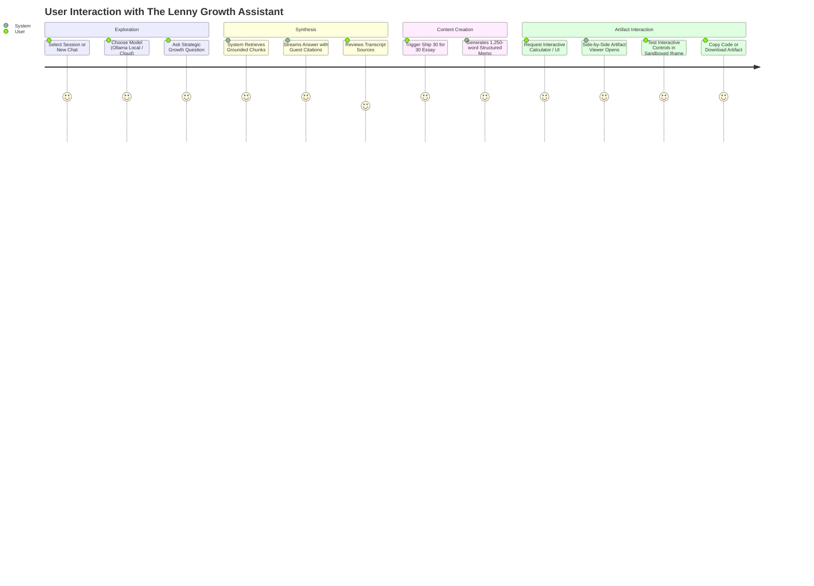

# Product Requirement Document (PRD)
## Project: The Lenny Growth Assistant
**Author:** Forward Deployed Engineer  
**Status:** In Progress / Forward Deployment Active  
**Target Delivery:** Evaluation Demo & Production Candidate  

---

### 1. Executive Summary
Lenny Rachitsky’s podcast represents one of the highest-signal repositories of product management, growth, leadership, and startup execution knowledge in the technology industry. However, with over 200 episodes spanning 300+ hours of conversational audio, extracting concrete, actionable frameworks in the moment of need is virtually impossible for busy practitioners.

**The Lenny Growth Assistant** is an enterprise-grade AI knowledge application that ingests the full transcript corpus, answers nuanced product and growth queries with exact transcript citations, transforms tactical insights into structured 1,250-word "Ship 30 for 30" essays, and dynamically renders interactive or formatted artifacts (Markdown and sandboxed HTML/CSS) side-by-side in the interface.

---

### 2. User Persona & Problem Statement

#### 2.1 Primary Persona: The Growth & Product Leader
- **Role:** Head of Growth, Lead Product Manager, or Founder.
- **Jobs to be Done (JTBD):**
  1. *Immediate Operational Guidance:* When facing a specific growth problem (e.g., pricing model shift, cold-start marketplace chicken-and-egg problem, activation drop-off), quickly find how elite operators (e.g., Brian Chesky, Shishir Mehrotra, Elena Verna) solved it.
  2. *Synthesizing & Sharing Insights:* Transform podcast wisdom into internal memos, execution checklists, or team guides without spending 3 hours listening and note-taking.
  3. *Prototyping Tools & Artifacts:* Instantly generate working calculators, pricing matrix templates, or interactive ROI widgets grounded in the podcast’s frameworks.

#### 2.2 Core Friction & Pain Points
- **Unstructured Audio & Text:** Searching transcripts manually yields fragmented quotes stripped of actionable operational context.
- **Hallucination Risk:** Generic foundation LLMs frequently generate vague, generic product advice rather than the specific, counter-intuitive tactics discussed on the show.
- **Unsafe or Fragmented Artifacts:** Users want to immediately view and interact with generated tools (calculators, dashboards, frameworks) without copying raw HTML code into separate files or exposing themselves to XSS vulnerabilities.

---

### 3. Key Measurable Success Metrics

| Metric | Target | Rationale & Measurement Methodology |
| :--- | :--- | :--- |
| **Citation Accuracy** | $\ge 90\%$ | $\ge 90\%$ of generated factual claims must map directly to an attributed episode, guest, and approximate timestamp. |
| **Local Inference Latency** | $< 4\text{s}$ to first token | Local Ollama (`llama3.2:3b` / `llama3.1:8b`) must return the initial status and streamed tokens within 4 seconds. |
| **Hallucination Fallback Rate** | $100\%$ on out-of-domain queries | Out-of-corpus queries (e.g., non-product/general trivia) must trigger a graceful refusal rather than hallucinating. |
| **Artifact Render Safety** | $0$ Security Breaches / XSS | All HTML artifacts must render in a sandboxed `<iframe>` (`sandbox="allow-scripts"` without `allow-same-origin`) with zero access to parent DOM or cookies. |
| **Evaluation Operability** | $1$ Command Startup | System must boot completely via `docker-compose up` with automated health checks on Postgres, Backend, and Frontend. |

---

### 4. Assumptions & Discovery Constraints

1. **Client Infrastructure Readiness:** The evaluator’s local machine has standard developer tooling (Docker, 16 GB RAM) capable of hosting PostgreSQL + pgvector and running Ollama locally.
2. **Transcript Availability:** Transcripts from the public `LennysNewsletter/lennys-newsletterpodcastdata` repository serve as the canonical knowledge base (50 comprehensive podcast episodes).
3. **Dual Model Strategy:** The evaluator requires a fully functional local model demo (Ollama) to verify offline zero-cost capabilities, but also wants cloud provider parity (Anthropic Claude or OpenAI) for complex reasoning tasks.
4. **Untrusted LLM Output:** All generated code or HTML is treated as potentially malicious user input requiring strict browser sandbox isolation.

---

### 5. Scope & Non-Goals

#### 5.1 In-Scope (Phase 1 MVP)
- **FastAPI Core Backend:** Asynchronous REST API with PostgreSQL session persistence and pgvector similarity search.
- **Dynamic Dual-LLM Routing:** Runtime switching between Local Ollama and Cloud LLM via UI selector or request headers.
- **Transcript Ingestion Pipeline:** Automated script parsing metadata, chunking text into 500–800 token windows with speaker preservation, and generating vector embeddings (`all-MiniLM-L6-v2`).
- **Grounded Conversational RAG:** Semantic search with strict citation formatting `[Episode: Guest, Timestamp]` and relevance thresholding.
- **Ship 30 for 30 Content Engine:** Dedicated skill generating 1,250-word high-retention essays following the Ship 30 framework (hook, short paragraphs, bold anchors, actionable takeaways).
- **Side-by-Side Artifact Viewer:** Claude-style slide-out viewer rendering Markdown and sandboxed HTML/CSS with live preview and code inspection.
- **Docker Compose Deployment:** Multi-container setup (`db`, `backend`, `frontend`) with structured logging and health probes.

#### 5.2 Out-of-Scope (Deferred to Phase 2)
- Audio transcription pipeline directly from raw MP3s (relying on pre-processed transcripts).
- Multi-tenant enterprise SSO (OAuth2 / SAML); Phase 1 provides lightweight session UUID tracking.
- Distributed background job queues (Celery/Temporal); ingestion runs as a deterministic idempotent CLI command.

---

### 6. User Journeys & Interaction Flows

---

### 7. Key Risks & Mitigation Strategies

1. **Risk: Local Model Hallucination & Reasoning Limitations (8B vs 70B+)**
   - *Mitigation:* Strict system prompt constraints, similarity distance cutoff (similarity $\ge 0.55$), and chunk context window injection. If no relevant chunks meet the cutoff, the agent returns an explicit fallback.
2. **Risk: XSS / Malicious Code Injection in Artifact Viewer**
   - *Mitigation:* DOMPurify sanitization before injection into an `<iframe>` configured strictly with `sandbox="allow-scripts"` (omitting `allow-same-origin` to isolate from cookies, localStorage, and parent window).
3. **Risk: Dependency on Local Ollama Startup**
   - *Mitigation:* Backend health check probe (`/api/health`) validates Ollama connectivity on startup and returns clear diagnostics if Ollama is unreachable or the requested model is missing.
4. **Risk: Database Cold-Start Latency**
   - *Mitigation:* Docker Compose includes `healthcheck` on the `db` service (`pg_isready -U postgres`), ensuring the backend only initializes once pgvector is fully operational.
