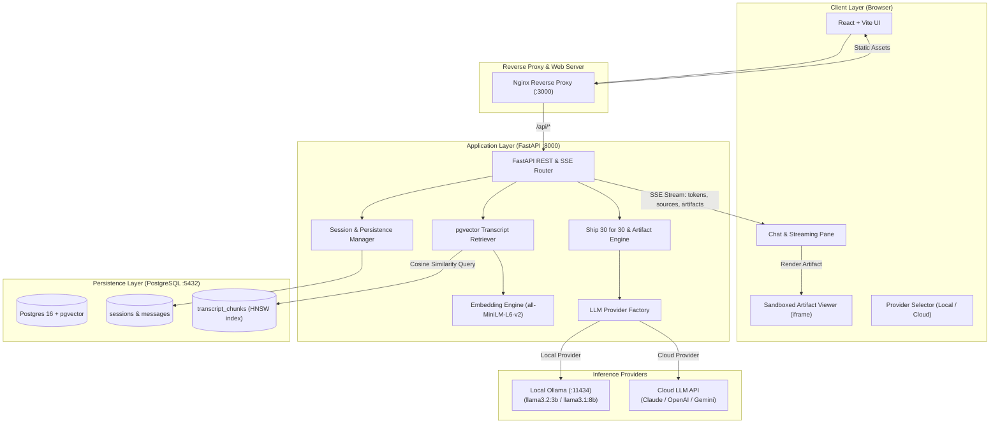
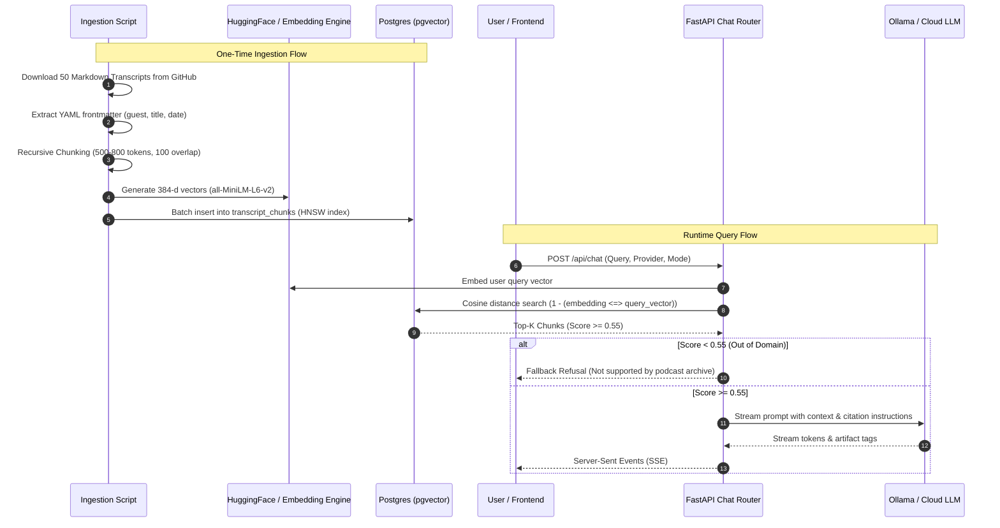

# Architecture Specification: The Lenny Growth Assistant

**Version:** 1.0.0  
**Author:** Forward Deployed Engineer  
**Status:** Approved for Implementation  

---

### 1. System Overview & Architecture Topology

The Lenny Growth Assistant is a containerized, decoupled 3-tier architecture consisting of:
1. **Frontend:** React + Vite (TypeScript + Tailwind CSS), served via high-performance Nginx with reverse proxy. Includes a Claude-style dual-pane layout with a sandboxed Artifact Viewer.
2. **Backend API & Agent Layer:** FastAPI (Python 3.11+) implementing asynchronous streaming (SSE), multi-provider LLM abstraction, session lifecycle management, and knowledge retrieval.
3. **Storage & Vector Store:** PostgreSQL 16 with the `pgvector` extension, maintaining relational conversation state, metadata, and an HNSW cosine distance vector index.



---

### 2. Database Schema (PostgreSQL + pgvector)

```sql
-- Enable pgvector extension
CREATE EXTENSION IF NOT EXISTS vector;
CREATE EXTENSION IF NOT EXISTS "uuid-ossp";

-- 1. Conversation Sessions
CREATE TABLE IF NOT EXISTS sessions (
    id UUID PRIMARY KEY DEFAULT uuid_generate_v4(),
    title VARCHAR(255) NOT NULL DEFAULT 'New Conversation',
    provider VARCHAR(50) NOT NULL DEFAULT 'ollama',
    created_at TIMESTAMP WITH TIME ZONE DEFAULT CURRENT_TIMESTAMP,
    updated_at TIMESTAMP WITH TIME ZONE DEFAULT CURRENT_TIMESTAMP
);

-- 2. Chat Messages
CREATE TABLE IF NOT EXISTS messages (
    id UUID PRIMARY KEY DEFAULT uuid_generate_v4(),
    session_id UUID NOT NULL REFERENCES sessions(id) ON DELETE CASCADE,
    role VARCHAR(20) NOT NULL CHECK (role IN ('user', 'assistant', 'system')),
    content TEXT NOT NULL,
    sources JSONB DEFAULT '[]'::jsonb,
    created_at TIMESTAMP WITH TIME ZONE DEFAULT CURRENT_TIMESTAMP
);

CREATE INDEX idx_messages_session_id ON messages(session_id);

-- 3. Artifacts (Rendered alongside chat)
CREATE TABLE IF NOT EXISTS artifacts (
    id UUID PRIMARY KEY DEFAULT uuid_generate_v4(),
    message_id UUID REFERENCES messages(id) ON DELETE CASCADE,
    session_id UUID NOT NULL REFERENCES sessions(id) ON DELETE CASCADE,
    identifier VARCHAR(100) NOT NULL,
    title VARCHAR(255) NOT NULL,
    artifact_type VARCHAR(20) NOT NULL CHECK (artifact_type IN ('markdown', 'html')),
    content TEXT NOT NULL,
    created_at TIMESTAMP WITH TIME ZONE DEFAULT CURRENT_TIMESTAMP
);

CREATE INDEX idx_artifacts_session_id ON artifacts(session_id);

-- 4. Transcript Chunks & Vector Store
CREATE TABLE IF NOT EXISTS transcript_chunks (
    id SERIAL PRIMARY KEY,
    episode_slug VARCHAR(255) NOT NULL,
    episode_title VARCHAR(255) NOT NULL,
    guest_name VARCHAR(255) NOT NULL,
    publish_date DATE,
    timestamp_ref VARCHAR(20),
    chunk_index INT NOT NULL,
    chunk_text TEXT NOT NULL,
    token_count INT NOT NULL,
    embedding vector(384) NOT NULL
);

-- HNSW Cosine Distance Index for < 10ms retrieval
CREATE INDEX IF NOT EXISTS idx_chunks_hnsw_cosine 
ON transcript_chunks USING hnsw (embedding vector_cosine_ops)
WITH (m = 16, ef_construction = 64);

CREATE INDEX idx_chunks_guest ON transcript_chunks(guest_name);
```

---

### 3. API Contracts & Endpoints

#### 3.1 Session Management
- `POST /api/sessions`: Create a new conversation.
  - *Response:* `{ "id": "uuid", "title": "New Conversation", "provider": "ollama", "created_at": "..." }`
- `GET /api/sessions`: List user sessions.
  - *Response:* `[{ "id": "...", "title": "...", "updated_at": "..." }]`
- `GET /api/sessions/{session_id}`: Retrieve message history, sources, and linked artifacts.
- `DELETE /api/sessions/{session_id}`: Delete session.

#### 3.2 Streaming Chat & RAG Engine
- `POST /api/chat`: Server-Sent Events (SSE) streaming endpoint.
  - *Request Body:*
    ```json
    {
      "session_id": "3fa85f64-5717-4562-b3fc-2c963f66afa6",
      "message": "What did Brian Chesky say about designing 11-star experiences?",
      "provider": "ollama",
      "mode": "default" // "default" | "ship30"
    }
    ```
  - *SSE Event Format:*
    - Status: `data: {"type": "status", "content": "Searching transcripts for Brian Chesky..."}\n\n`
    - Sources: `data: {"type": "sources", "sources": [{"episode": "Brian Chesky: Designing 11-Star Experiences", "guest": "Brian Chesky", "timestamp": "00:14:22", "score": 0.82}]}\n\n`
    - Tokens: `data: {"type": "token", "content": "Brian "}\n\n`
    - Artifact: `data: {"type": "artifact", "artifact": {"identifier": "experience-framework", "type": "markdown", "title": "The 11-Star Framework", "content": "..."}}\n\n`
    - Done: `data: [DONE]\n\n`

#### 3.3 Health & Observability
- `GET /api/health`: System health check.
  - *Response:*
    ```json
    {
      "status": "healthy",
      "database": "connected",
      "pgvector": "operational",
      "chunks_indexed": 4820,
      "providers": {
        "ollama": { "status": "online", "model": "llama3.2:3b" },
        "cloud": { "status": "configured", "provider": "anthropic" }
      }
    }
    ```

---

### 4. Knowledge Ingestion & Retrieval Pipeline



---

### 5. Multi-Provider LLM & Dynamic Routing Layer

The application features a clean adapter pattern decoupling the business logic from specific LLM providers:

```
                  ┌──────────────────────┐
                  │   BaseLLMProvider    │
                  │   (Abstract Base)    │
                  └──────────┬───────────┘
                             │
            ┌────────────────┴────────────────┐
            ▼                                 ▼
┌───────────────────────┐         ┌───────────────────────┐
│    OllamaProvider     │         │     CloudProvider     │
│  - http://localhost   │         │  - Anthropic Claude   │
│  - Streaming /api/chat│         │  - OpenAI / Gemini    │
│  - Zero API Cost      │         │  - Deep Reasoning     │
└───────────────────────┘         └───────────────────────┘
```

- **Runtime Selection:** The active provider is determined per request via `req.provider` ("ollama" or "cloud"), defaulting to `DEFAULT_LLM_PROVIDER` in `.env`.
- **Fault-Tolerant Fallback:** If the cloud provider fails due to rate limits or invalid keys, the system gracefully advises the user or falls back to Ollama. If Ollama is offline, clear instructions are returned to boot Ollama.

---

### 6. Security & Sandbox Architecture for Artifacts

Untrusted HTML/CSS artifacts generated by LLMs represent an XSS attack vector if rendered unsafely. The system implements a defense-in-depth security model:

```
[ LLM Generated HTML/CSS ]
          │
          ▼
   1. DOMPurify Sanitization
      - Strips malicious attributes
      - Normalizes markup
          │
          ▼
   2. Sandboxed <iframe> Mount
      - sandbox="allow-scripts"
      - EXPLICITLY OMITS "allow-same-origin"
          │
          ▼
[ Isolated Execution Context ]
  - CANNOT access parent window or DOM
  - CANNOT access parent localStorage / sessionStorage
  - CANNOT read or transmit parent authentication cookies
  - CAN run internal interactive JavaScript (calculators, sliders, charts)
```
